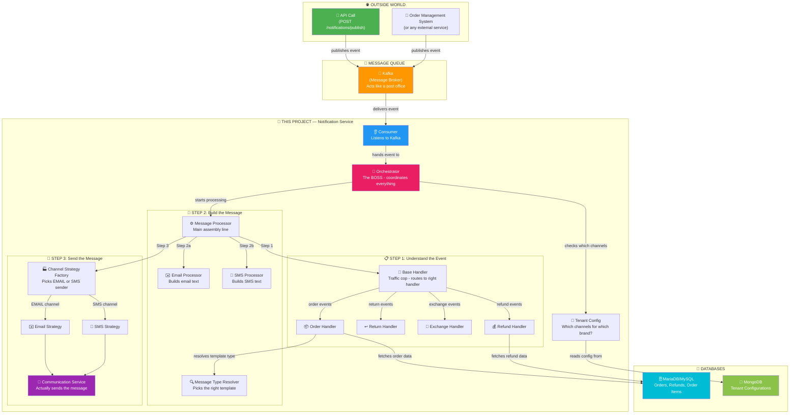
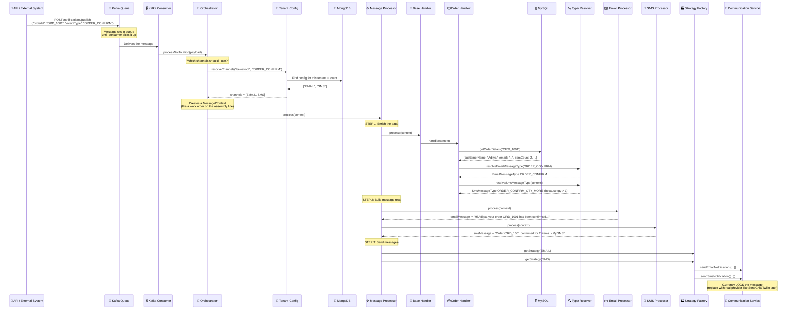
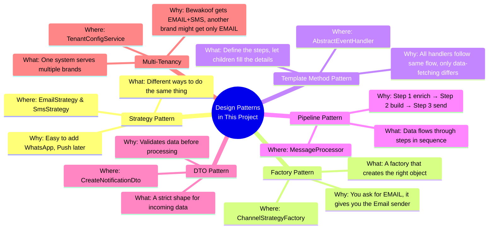

# 🔔 OMS Notification Service

A **production-grade, event-driven notification service** built with **NestJS** and **TypeScript** for an Order Management System (OMS).

When a customer places an order, receives a refund, or initiates a return — this service figures out **what** message to send, to **which** channels (Email, SMS), builds the actual message text, and dispatches it. Think of it as the communication backbone behind platforms like Flipkart, Bewakoof, or Swiggy.

---

## 📌 Table of Contents

- [Architecture Overview](#-architecture-overview)
- [How It Works — The Request Lifecycle](#-how-it-works--the-request-lifecycle)
- [Tech Stack](#-tech-stack)
- [Design Patterns Used](#-design-patterns-used)
- [Supported Events](#-supported-events)
- [Project Structure](#-project-structure)
- [Component Deep Dive](#-component-deep-dive)
- [API Endpoints](#-api-endpoints)
- [Environment Variables](#-environment-variables)
- [Getting Started](#-getting-started)
- [Testing the Flow](#-testing-the-flow)
- [Future Scope](#-future-scope)

---

## 🏗️ Architecture Overview



---

## 🔄 How It Works — The Request Lifecycle

Here's exactly what happens when a notification event is triggered, step by step:

### Step 1 — Event Ingestion
The OMS client sends a notification event via one of two entry points:
- **REST API** → `POST /notifications/publish` → The **NotificationController** publishes the payload to Kafka.
- **Kafka Consumer** → The **NotificationConsumer** listens on the `comms-email-sms-topic` Kafka topic and picks up events automatically.

Both paths converge at the **OrchestratorService**.

### Step 2 — Channel Resolution (Orchestrator)
The **OrchestratorService** takes the incoming payload and:
1. Checks if channels (EMAIL, SMS) were explicitly provided in the request.
2. If not, queries **MongoDB** to resolve the tenant's channel config — which channels are enabled for which event type.
3. Builds a `MessageContext` object containing all the information needed downstream.

### Step 3 — Domain Handling (BaseHandler → Domain Handlers)
The **MessageProcessor** passes the context to the **BaseHandler**, which uses a **registry map** (not if-else chains) to route to the correct domain handler:

| Handler | Events Handled |
|---|---|
| **OrderHandler** | `ORDER_CONFIRM`, `ORDER_SHIPPED`, `ORDER_DELIVERED`, `ORDER_DELIVERY_DELAYED`, `ORDER_CANCELLED`, `ORDER_FAILED` |
| **ReturnHandler** | `RETURN_INITIATED`, `RETURN_CANCELLED` |
| **ExchangeHandler** | `EXCHANGE_INITIATED`, `EXCHANGE_CANCELLED` |
| **RefundHandler** | `REFUND_INITIATED` |

Each handler extends **AbstractEventHandler**, which:
1. **Fetches event-specific data** from MariaDB (order details, refund amounts, item counts, etc.) via **HelpersService**.
2. **Merges it** into `context.additionalData`.
3. **Falls back** to fetched contact info (email/phone) if not provided in the payload.
4. **Resolves message types** via **MessageTypeResolver** — mapping event types to the correct `EmailMessageType` and `SmsMessageType`.

### Step 4 — Message Building (Processors)
The **MessageProcessor** checks which channels are active and calls the appropriate processor:
- **EmailProcessor** — Looks up the `EmailMessageType` in a template map and builds a personalized email string (e.g., _"Hi Aditya, your order ORD_1001 has been confirmed. Total: ₹2499."_).
- **SmsProcessor** — Same approach but with **quantity-aware templates**. For shipped/delivered/delayed events, SMS copy varies based on item count (1 item, 2 items, 3+ items). Appends brand name suffix.

### Step 5 — Channel Dispatch (Strategy Pattern)
The **ChannelStrategyFactory** picks the right strategy at runtime:
- **EmailStrategy** → calls `CommunicationService.sendEmailNotification()`
- **SmsStrategy** → calls `CommunicationService.sendSmsNotification()` with the correct DLT template ID

All channels are dispatched **concurrently** using `Promise.allSettled()` — if one channel fails, the others still go through.

### Step 6 — Communication Service (Outbound Gateway)
The **CommunicationService** is the final boundary. Currently it logs the outgoing message — swap the method bodies with real provider SDK calls (SendGrid, Twilio, MSG91, etc.) when integrating.

### 📊 Complete Flow — Sequence Diagram



---

## 🛠️ Tech Stack

| Technology | Purpose |
|---|---|
| **NestJS 11** | Application framework (modules, DI, decorators) |
| **TypeScript** | Type-safe development |
| **Apache Kafka** | Event streaming — async event ingestion and processing |
| **MongoDB + Mongoose** | Stores tenant-level channel configurations |
| **MariaDB / MySQL + TypeORM** | Stores order, order item, and refund transactional data |
| **Docker Compose** | One-command local infrastructure (Kafka, Zookeeper, MongoDB, MariaDB) |
| **class-validator** | DTO validation with decorators |
| **class-transformer** | Payload transformation |

---

## 🧩 Design Patterns Used



| Pattern | Where | Why |
|---|---|---|
| **Strategy Pattern** | `ChannelStrategyFactory`, `EmailStrategy`, `SmsStrategy` | Channels are interchangeable — adding WhatsApp/Push is just a new class + registration |
| **Factory Pattern** | `ChannelStrategyFactory` | Runtime channel selection from a `Map<Channel, Strategy>` |
| **Template Method** | `AbstractEventHandler` → domain handlers | Shared flow (fetch → merge → resolve) with customizable `fetchEventDetails()` |
| **Registry Pattern** | `BaseHandler.eventHandlerMap` | Routes events to handlers via a `Map`, zero switch-case |
| **Pipeline Pattern** | `MessageProcessor` | Data flows: validate → enrich → build → send in sequence |
| **DTO Pattern** | `CreateNotificationDto` with `class-validator` | Validates incoming data at the door — bad payloads get rejected |
| **Multi-Tenancy** | `TenantConfigService` + MongoDB | One system serves multiple brands, each with different channel configs |
| **Dependency Injection** | Entire project via NestJS `@Injectable()` | Loose coupling, testability |

---

## 📋 Supported Events

### Event Types (`CommsEventType`)
| Domain | Events |
|---|---|
| **Order** | `ORDER_CONFIRM`, `ORDER_SHIPPED`, `ORDER_DELIVERED`, `ORDER_DELIVERY_DELAYED`, `ORDER_CANCELLED`, `ORDER_FAILED` |
| **Return** | `RETURN_INITIATED`, `RETURN_CANCELLED` |
| **Exchange** | `EXCHANGE_INITIATED`, `EXCHANGE_CANCELLED` |
| **Refund** | `REFUND_INITIATED` |

### SMS Quantity Variants
For **shipped**, **delivered**, and **delivery delayed** events, SMS templates vary by item count:

| Item Count | Template Variant |
|---|---|
| 1 item | `ORDER_SHIPPED_QTY_1`, `ORDER_DELIVERED_QTY_1`, etc. |
| 2 items | `ORDER_SHIPPED_QTY_2`, `ORDER_DELIVERED_QTY_2`, etc. |
| 3+ items | `ORDER_SHIPPED_QTY_3_PLUS`, `ORDER_DELIVERED_QTY_3_PLUS`, etc. |

This is resolved automatically by the **MessageTypeResolver** using the `getItemCountBucket()` utility.

---

## 📁 Project Structure

```
src/
├── app.module.ts                          # Root module — wires MongoDB, MariaDB, Kafka
├── main.ts                                # Bootstrap — starts HTTP + Kafka microservice
│
└── notification/
    ├── notification.module.ts             # Feature module — registers all providers
    │
    ├── config/
    │   ├── comms.enum.ts                  # CommsEventType, EmailMessageType, SmsMessageType
    │   ├── comms.constants.ts             # Event → MessageType mapping tables
    │   ├── kafka.constants.ts             # Kafka topics, client IDs, consumer groups
    │   └── sms.constants.ts              # SMS brand name, DLT template ID map
    │
    ├── controllers/
    │   ├── notification.controller.ts     # POST /notifications/publish (→ Kafka)
    │   ├── tenant-config.controller.ts    # POST /tenant-config/seed
    │   └── test-data.controller.ts        # POST /test-data/seed
    │
    ├── consumers/
    │   └── notification.consumer.ts       # Kafka @EventPattern consumer
    │
    ├── dto/
    │   └── create-notification.dto.ts     # Validated payload (class-validator)
    │
    ├── entities/                          # TypeORM entities (MariaDB)
    │   ├── order.entity.ts
    │   ├── order-item.entity.ts
    │   └── refund.entity.ts
    │
    ├── enums/
    │   └── communication-channel.enum.ts  # EMAIL, SMS
    │
    ├── factories/
    │   └── channel-strategy.factory.ts    # Map<Channel, Strategy> runtime picker
    │
    ├── handlers/
    │   ├── abstract-event.handler.ts      # Template method — shared fetch→merge→resolve
    │   ├── base.handler.ts                # Registry — routes eventType to handler
    │   ├── order.handler.ts
    │   ├── exchange.handler.ts
    │   ├── return.handler.ts
    │   └── refund.handler.ts
    │
    ├── interfaces/
    │   ├── channel-strategy.interface.ts  # IChannelStrategy { channel, send() }
    │   └── event-handler.interface.ts     # IEventHandler { supportedEvents, handle() }
    │
    ├── processors/
    │   ├── message.processor.ts           # Orchestrates: validate → handle → build → send
    │   ├── email.processor.ts             # Email template builder (11 templates)
    │   └── sms.processor.ts              # SMS template builder (18 templates, qty-aware)
    │
    ├── resolvers/
    │   └── message-type.resolver.ts       # Event → EmailMessageType / SmsMessageType
    │
    ├── schemas/
    │   └── tenant-config.schema.ts        # Mongoose schema for tenant channel configs
    │
    ├── services/
    │   ├── orchestrator.service.ts         # Entry point — resolves channels, triggers processing
    │   ├── communication.service.ts        # Outbound gateway (Email/SMS provider boundary)
    │   ├── helpers.service.ts              # MariaDB data fetcher (orders, refunds, items)
    │   ├── kafka-producer.service.ts       # Kafka emit wrapper
    │   └── tenant-config.service.ts        # MongoDB tenant config CRUD + resolution
    │
    ├── strategies/
    │   ├── email.strategy.ts              # IChannelStrategy → CommunicationService.sendEmail
    │   └── sms.strategy.ts                # IChannelStrategy → CommunicationService.sendSms
    │
    ├── types/
    │   └── message-context.type.ts        # MessageContext — the data carrier through the pipeline
    │
    └── utils/
        └── item-count.util.ts             # getItemCountBucket(n) → QTY_1 | QTY_2 | QTY_3_PLUS
```

---

## 🔌 Component Deep Dive

### Orchestrator Service
The central coordinator. Receives the notification payload, resolves which channels to use (from the request or MongoDB tenant config), builds the `MessageContext`, and hands it to the `MessageProcessor`.

### Message Processor
The pipeline engine. Runs three steps in sequence:
1. **Validate** — ensures `userId`, `eventType`, and `channels` are present.
2. **Handle** — delegates to `BaseHandler` for domain-specific data enrichment.
3. **Build & Send** — builds email/SMS messages, then dispatches through channel strategies concurrently.

### Base Handler + Domain Handlers
`BaseHandler` maintains a `Map<CommsEventType, IEventHandler>` registry. Each domain handler (`OrderHandler`, `ReturnHandler`, etc.) self-registers its supported events. When an event arrives, the base handler looks it up and delegates — **no switch-case, no if-else chains**.

Each handler extends `AbstractEventHandler` which defines a **Template Method**:
1. Call `fetchEventDetails()` (abstract — each handler implements its own data fetch)
2. Merge data into `additionalData`
3. Fall back to fetched email/phone if missing
4. Resolve `EmailMessageType` and `SmsMessageType`

### Message Type Resolver
Maps `CommsEventType` → channel-specific message types. Email mapping is 1:1. SMS mapping is more nuanced — for shipped/delivered/delayed events, the SMS template varies by **item count** (1, 2, or 3+ items), resolved via `ItemCountBucket`.

### Email & SMS Processors
Template-driven message builders. Each uses a `Record<MessageType, TemplateBuilder>` map — TypeScript's compiler **enforces** that every message type has a template. No message type can be added without a matching template.

### Channel Strategy Factory
Classic **Strategy Pattern** via a `Map<CommunicationChannel, IChannelStrategy>`. At runtime, the factory returns the correct strategy (`EmailStrategy` or `SmsStrategy`). Adding a new channel (WhatsApp, Push) means:
1. Create a new strategy implementing `IChannelStrategy`
2. Register it in the factory's map

### Tenant Config Service
Reads per-tenant channel configurations from MongoDB. Example config:
```json
{
  "tenantId": "bewakoof",
  "key": "COMMS_CHANNEL_CONFIG",
  "value": {
    "ORDER_CONFIRM": ["EMAIL", "SMS"],
    "ORDER_SHIPPED": ["EMAIL"],
    "RETURN_INITIATED": ["SMS"],
    "REFUND_INITIATED": ["EMAIL", "SMS"]
  }
}
```
Different tenants can have different channel preferences per event type.

### Communication Service
The **outbound boundary**. Currently logs messages to console. In production, replace the method bodies with actual provider SDK calls (e.g., SendGrid for email, MSG91/Twilio for SMS).

---

## 🌐 API Endpoints

### `POST /notifications/publish`
Publish a notification event to Kafka for async processing.

**Request Body:**
```json
{
  "userId": "u1",
  "orderId": "ORD_1001",
  "tenantId": "bewakoof",
  "email": "aditya@example.com",
  "phone": "9876543210",
  "eventType": "ORDER_CONFIRM",
  "channels": ["EMAIL", "SMS"]
}
```

| Field | Required | Description |
|---|---|---|
| `userId` | ✅ | User identifier |
| `orderId` | ✅ | Order identifier |
| `tenantId` | ✅ | Tenant identifier (for multi-tenant config) |
| `email` | ❌ | Recipient email (falls back to DB if omitted) |
| `phone` | ❌ | Recipient phone (falls back to DB if omitted) |
| `eventType` | ✅ | One of the `CommsEventType` enum values |
| `channels` | ❌ | Override channels; if omitted, resolved from tenant config |

### `POST /tenant-config/seed`
Seeds default channel configuration for the `bewakoof` tenant into MongoDB.

### `POST /test-data/seed`
Seeds sample order, order items, and refund records into MariaDB for testing.

---

## ⚙️ Environment Variables

Create a `.env` file in the project root:

```env
# MongoDB
MONGO_URI=mongodb://localhost:27017/notification_system

# Kafka
KAFKA_BROKERS=localhost:9092
KAFKA_CLIENT_ID=notification-service
KAFKA_GROUP_ID=notification-consumer-group
KAFKA_COMMS_TOPIC=comms-email-sms-topic

# MariaDB / MySQL
DB_HOST=localhost
DB_PORT=3306
DB_USERNAME=app_user
DB_PASSWORD=app_password
DB_NAME=notification_system
```

---

## 🚀 Getting Started

### Prerequisites
- **Node.js** (v18+)
- **Docker** and **Docker Compose**

### 1. Clone the repository
```bash
git clone https://github.com/adityacosmos24/Oms-notification-service.git
cd Oms-notification-service
```

### 2. Start infrastructure
```bash
docker-compose up -d
```
This spins up:
- **Kafka** + **Zookeeper** (event streaming)
- **MongoDB** (tenant configs)
- **MariaDB** (order/refund data)

### 3. Install dependencies
```bash
npm install
```

### 4. Start the application
```bash
npm run start:dev
```
The app starts on `http://localhost:3000` with the Kafka microservice connected.

---

## 🧪 Testing the Flow

### Step 1 — Seed test data
```bash
# Seed order, order items, and refund data into MariaDB
curl -X POST http://localhost:3000/test-data/seed

# Seed tenant channel config into MongoDB
curl -X POST http://localhost:3000/tenant-config/seed
```

### Step 2 — Trigger a notification
```bash
curl -X POST http://localhost:3000/notifications/publish \
  -H "Content-Type: application/json" \
  -d '{
    "userId": "u1",
    "orderId": "ORD_1001",
    "tenantId": "bewakoof",
    "eventType": "ORDER_CONFIRM"
  }'
```

### Step 3 — Watch the logs
The application will log the full processing pipeline:
```
[NotificationConsumer] Consumed Kafka notification event...
[CommunicationService] Sending EMAIL to aditya@example.com for user u1: Hi Aditya, your order ORD_1001 has been confirmed...
[CommunicationService] Sending SMS to 9876543210 for user u1: Order ORD_1001 confirmed successfully. - MyOMS
```

### Try different events
```bash
# Refund notification
curl -X POST http://localhost:3000/notifications/publish \
  -H "Content-Type: application/json" \
  -d '{"userId":"u1","orderId":"ORD_1001","tenantId":"bewakoof","eventType":"REFUND_INITIATED"}'

# Return notification
curl -X POST http://localhost:3000/notifications/publish \
  -H "Content-Type: application/json" \
  -d '{"userId":"u1","orderId":"ORD_1001","tenantId":"bewakoof","eventType":"RETURN_INITIATED","channels":["SMS"]}'
```

---

## 🔮 Future Scope

- [ ] **WhatsApp / Push Notification** channels — just add a new strategy
- [ ] **Template engine** — replace string templates with Handlebars/EJS for rich HTML emails
- [ ] **Dead letter queue** — retry failed notifications
- [ ] **Notification audit log** — track delivery status per user per channel
- [ ] **Rate limiting** — throttle notifications per user
- [ ] **Provider SDK integration** — plug in SendGrid, Twilio, MSG91, etc.

---

## 📄 License

This project is private and unlicensed.
