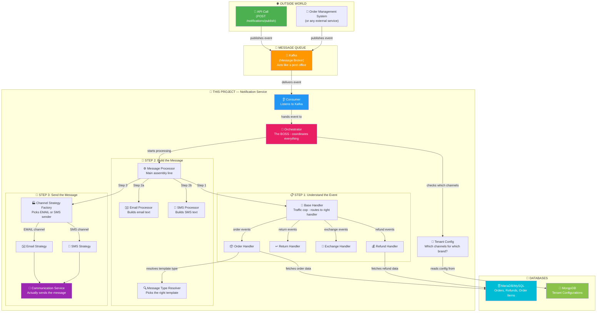
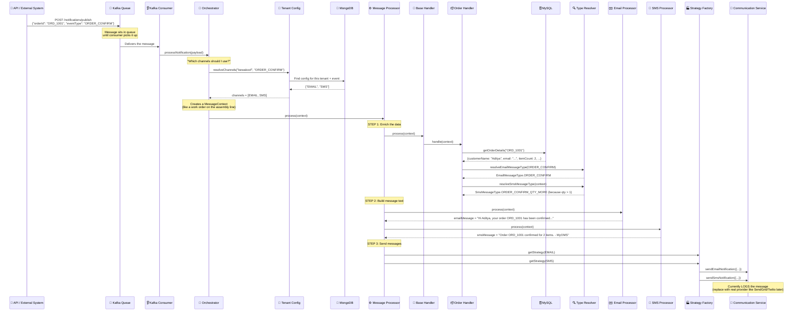
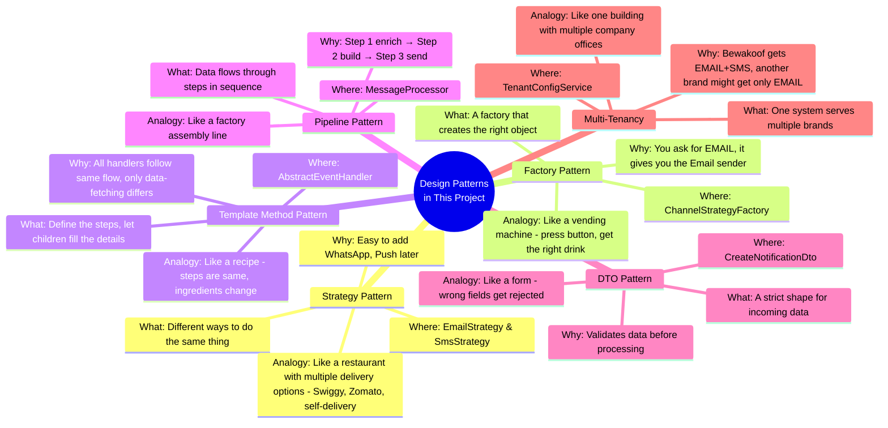
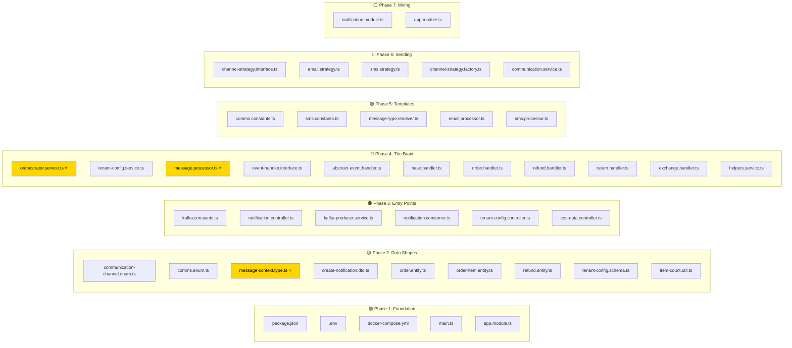

# 🔔 Notification System — Complete Project Understanding Guide

---

## What is this project in ONE line?

> **An e-commerce backend service that receives events like "order confirmed" or "refund initiated" and automatically sends the right Email and/or SMS to the customer.**

Think of it like this: Flipkart/Bewakoof processes your order → this system figures out WHAT message to send, to WHICH channels (Email, SMS), builds the actual text, and delivers it.

---

## 🗺️ The Big Picture — How Everything Connects



---

## 🏭 The Complete Flow — Step by Step (Like a Factory Assembly Line)



---

## 🧱 Project Folder Structure — What Each Folder Does

```
notification-system/
│
├── docker-compose.yml        🐳 Starts Kafka, MongoDB, MariaDB in containers
├── .env                      🔐 Database URLs, Kafka addresses (secrets)
├── package.json              📦 Lists all libraries this project uses
│
└── src/
    ├── main.ts               🚪 THE FRONT DOOR — starts everything
    ├── app.module.ts          🧩 Connects databases + loads notification module
    │
    └── notification/          📂 ALL the business logic lives here
        │
        ├── notification.module.ts   🧩 Registers all the parts together
        │
        ├── config/            ⚙️ SETTINGS & MAPPINGS
        │   ├── comms.enum.ts         📋 List of all event types (ORDER_CONFIRM, RETURN_INITIATED, etc.)
        │   ├── comms.constants.ts    🗺️ Maps: Event → Email template type, Event → SMS template type
        │   ├── sms.constants.ts      🆔 Maps: SMS type → Provider template ID
        │   └── kafka.constants.ts    📨 Kafka topic names, client IDs
        │
        ├── dto/               📩 DATA VALIDATION (what shape must incoming data have?)
        │   └── create-notification.dto.ts
        │
        ├── types/             📐 TYPE DEFINITIONS (what shape does internal data have?)
        │   └── message-context.type.ts    ← THE most important type in the whole project
        │
        ├── enums/             🏷️ LABELS
        │   └── communication-channel.enum.ts   (EMAIL or SMS)
        │
        ├── entities/          🗄️ DATABASE TABLE SHAPES (MySQL/MariaDB)
        │   ├── order.entity.ts
        │   ├── order-item.entity.ts
        │   └── refund.entity.ts
        │
        ├── schemas/           🍃 DATABASE DOCUMENT SHAPES (MongoDB)
        │   └── tenant-config.schema.ts
        │
        ├── controllers/       🚪 API ENTRY POINTS (HTTP endpoints)
        │   ├── notification.controller.ts   POST /notifications/publish
        │   ├── tenant-config.controller.ts  POST /tenant-config/seed
        │   └── test-data.controller.ts      POST /test-data/seed
        │
        ├── consumers/         👂 KAFKA LISTENERS
        │   └── notification.consumer.ts
        │
        ├── services/          🧠 BUSINESS LOGIC
        │   ├── orchestrator.service.ts      The BOSS — coordinates the pipeline
        │   ├── helpers.service.ts           Fetches data from MySQL
        │   ├── tenant-config.service.ts     Fetches config from MongoDB
        │   ├── kafka-producer.service.ts    Pushes messages TO Kafka
        │   └── communication.service.ts     Actually sends Email/SMS (stub)
        │
        ├── handlers/          🎯 EVENT-SPECIFIC LOGIC
        │   ├── abstract-event.handler.ts    Shared logic for all handlers
        │   ├── base.handler.ts              Routes events to correct handler
        │   ├── order.handler.ts             Handles ORDER_* events
        │   ├── return.handler.ts            Handles RETURN_* events
        │   ├── exchange.handler.ts          Handles EXCHANGE_* events
        │   └── refund.handler.ts            Handles REFUND_* events
        │
        ├── resolvers/         🔍 TEMPLATE TYPE SELECTION
        │   └── message-type.resolver.ts     Picks right template based on event + item count
        │
        ├── processors/        ⚙️ MESSAGE BUILDING
        │   ├── message.processor.ts         Main assembly line (calls handler → builds → sends)
        │   ├── email.processor.ts           Builds email text from template
        │   └── sms.processor.ts             Builds SMS text from template
        │
        ├── factories/         🏭 OBJECT CREATION
        │   └── channel-strategy.factory.ts  Returns the right sender (Email or SMS)
        │
        ├── strategies/        📤 SENDING LOGIC
        │   ├── email.strategy.ts            Sends via email
        │   └── sms.strategy.ts              Sends via SMS
        │
        ├── interfaces/        📜 CONTRACTS (rules that classes must follow)
        │   ├── channel-strategy.interface.ts
        │   └── event-handler.interface.ts
        │
        └── utils/             🔧 HELPER FUNCTIONS
            └── item-count.util.ts           Groups item count into buckets (1, 2, 3+)
```

---

## 🎓 Design Patterns Used (What Makes This Code "Professional")



---

## 📚 LEARNING PHASES — Your Step-by-Step Roadmap

---

### 🟢 Phase 1: The Foundation — "What is this project and how does it start?"

**Goal:** Understand what technologies are used and how the app boots up.

**Layman Explanation:**
> Imagine you're opening a restaurant. Before you serve any food, you need to set up the kitchen (databases), hire delivery partners (Kafka), and open the front door (HTTP server). Phase 1 is about understanding this setup.

**Files to read (in this order):**

| # | File | What to understand |
|---|------|--------------------|
| 1 | [package.json](file:///c:/Users/acer/Desktop/Projects/notification-system/package.json) | What libraries/tools does this project use? (NestJS, Kafka, MongoDB, MySQL) |
| 2 | [.env](file:///c:/Users/acer/Desktop/Projects/notification-system/.env) | What are the secret values? (database URLs, Kafka addresses) |
| 3 | [docker-compose.yml](file:///c:/Users/acer/Desktop/Projects/notification-system/docker-compose.yml) | How do Kafka, MongoDB, MariaDB start? (they run in Docker containers) |
| 4 | [main.ts](file:///c:/Users/acer/Desktop/Projects/notification-system/src/main.ts) | THE FRONT DOOR — how does the app start? It creates an HTTP server AND connects to Kafka |
| 5 | [app.module.ts](file:///c:/Users/acer/Desktop/Projects/notification-system/src/app.module.ts) | THE WIRING — connects MongoDB, MySQL, and loads the NotificationModule |

**Key concepts to understand:**
- **NestJS** = A framework that organizes your backend code into Modules, Controllers, and Services
- **Kafka** = A message queue (like a post office between services)
- **MongoDB** = A flexible database for configurations (JSON-like documents)
- **MariaDB/MySQL** = A structured database for orders, refunds (rows & columns like Excel)
- **Docker** = Runs databases in isolated containers so you don't install them on your machine

**Questions to ask yourself:**
- Why does the app start BOTH an HTTP server AND a Kafka microservice?
- Why use TWO different databases (MongoDB AND MySQL)?

---

### 🟡 Phase 2: The Data Shapes — "What does the data look like?"

**Goal:** Understand the shape of data flowing through the system.

**Layman Explanation:**
> Before you can process an order notification, you need to know: What does an order look like? What does a refund look like? What channels exist (Email, SMS)? What events can happen (order confirmed, order shipped)? Phase 2 is about understanding these shapes.

**Files to read (in this order):**

| # | File | What to understand |
|---|------|--------------------|
| 1 | [communication-channel.enum.ts](file:///c:/Users/acer/Desktop/Projects/notification-system/src/notification/enums/communication-channel.enum.ts) | The 2 ways to reach a customer: EMAIL and SMS |
| 2 | [comms.enum.ts](file:///c:/Users/acer/Desktop/Projects/notification-system/src/notification/config/comms.enum.ts) | ALL possible events (11 types), ALL email message types, ALL SMS message types |
| 3 | [message-context.type.ts](file:///c:/Users/acer/Desktop/Projects/notification-system/src/notification/types/message-context.type.ts) | **THE MOST IMPORTANT FILE** — the "work order" that travels through the entire pipeline |
| 4 | [create-notification.dto.ts](file:///c:/Users/acer/Desktop/Projects/notification-system/src/notification/dto/create-notification.dto.ts) | What data must someone send to trigger a notification? (validated input) |
| 5 | [order.entity.ts](file:///c:/Users/acer/Desktop/Projects/notification-system/src/notification/entities/order.entity.ts) | What does an order row look like in MySQL? |
| 6 | [order-item.entity.ts](file:///c:/Users/acer/Desktop/Projects/notification-system/src/notification/entities/order-item.entity.ts) | Individual products within an order |
| 7 | [refund.entity.ts](file:///c:/Users/acer/Desktop/Projects/notification-system/src/notification/entities/refund.entity.ts) | What does a refund row look like in MySQL? |
| 8 | [tenant-config.schema.ts](file:///c:/Users/acer/Desktop/Projects/notification-system/src/notification/schemas/tenant-config.schema.ts) | How tenant config is stored in MongoDB |
| 9 | [item-count.util.ts](file:///c:/Users/acer/Desktop/Projects/notification-system/src/notification/utils/item-count.util.ts) | How item counts are grouped into buckets (1 item, 2 items, 3+ items) |

**Key concepts to understand:**
- **DTO (Data Transfer Object)** = A "form" that validates incoming data
- **Entity** = A class that maps to a database table
- **Schema** = A class that maps to a MongoDB collection (document)
- **Enum** = A fixed list of allowed values (like a dropdown menu)
- **MessageContext** = The "passport" of a notification — carries ALL info as it moves through the system

**Questions to ask yourself:**
- Why is `MessageContext` different from `CreateNotificationDto`? (Hint: DTO is input, context is internal)
- Why does SMS have quantity variants (QTY_1, QTY_2, QTY_3_PLUS) but Email doesn't?
- Why is `channels` optional in the DTO? (Hint: tenant config can provide defaults)

---

### 🟠 Phase 3: The Entry Points — "How does data get IN?"

**Goal:** Understand how notifications enter the system (via HTTP API and Kafka).

**Layman Explanation:**
> A restaurant gets orders from two places: walk-in customers (HTTP API) and food delivery apps (Kafka). Phase 3 is about understanding both entry doors.

**Files to read (in this order):**

| # | File | What to understand |
|---|------|--------------------|
| 1 | [kafka.constants.ts](file:///c:/Users/acer/Desktop/Projects/notification-system/src/notification/config/kafka.constants.ts) | The "address" of the Kafka topic (like a mailbox name) |
| 2 | [notification.controller.ts](file:///c:/Users/acer/Desktop/Projects/notification-system/src/notification/controllers/notification.controller.ts) | HTTP entry point — receives POST request, pushes to Kafka |
| 3 | [kafka-producer.service.ts](file:///c:/Users/acer/Desktop/Projects/notification-system/src/notification/services/kafka-producer.service.ts) | How messages are PUSHED into Kafka |
| 4 | [notification.consumer.ts](file:///c:/Users/acer/Desktop/Projects/notification-system/src/notification/consumers/notification.consumer.ts) | How messages are PULLED from Kafka and handed to the Orchestrator |
| 5 | [tenant-config.controller.ts](file:///c:/Users/acer/Desktop/Projects/notification-system/src/notification/controllers/tenant-config.controller.ts) | Helper endpoint to seed tenant config |
| 6 | [test-data.controller.ts](file:///c:/Users/acer/Desktop/Projects/notification-system/src/notification/controllers/test-data.controller.ts) | Helper endpoint to seed test data in MySQL |

**Key concepts to understand:**
- **Controller** = Handles incoming HTTP requests (like a receptionist)
- **Consumer** = Listens to Kafka topics (like someone checking a mailbox continuously)
- **Producer** = Pushes messages into Kafka (like dropping a letter in the mailbox)
- **@Post('publish')** = This function runs when someone hits `POST /notifications/publish`
- **@EventPattern(topic)** = This function runs when a Kafka message arrives on that topic

**The interesting pattern:**
```
HTTP Request → Controller → KafkaProducer → Kafka → KafkaConsumer → Orchestrator
```
> Why not go directly from Controller to Orchestrator? Because Kafka acts as a **buffer** — if the system is busy, messages wait in the queue instead of being lost.

---

### 🔴 Phase 4: The Brain — "How are notifications processed?"

**Goal:** Understand the core processing pipeline (the heart of the project).

**Layman Explanation:**
> This is the kitchen of the restaurant. An order comes in, the chef (Orchestrator) tells the sous-chef (MessageProcessor) to: (1) figure out the dish details, (2) cook it, (3) plate and serve it. Phase 4 is understanding this assembly line.

**Files to read (in this order):**

| # | File | What to understand |
|---|------|--------------------|
| 1 | [orchestrator.service.ts](file:///c:/Users/acer/Desktop/Projects/notification-system/src/notification/services/orchestrator.service.ts) | **THE BOSS** — resolves channels, builds context, starts processing |
| 2 | [tenant-config.service.ts](file:///c:/Users/acer/Desktop/Projects/notification-system/src/notification/services/tenant-config.service.ts) | How the system decides which channels to use per tenant per event |
| 3 | [message.processor.ts](file:///c:/Users/acer/Desktop/Projects/notification-system/src/notification/processors/message.processor.ts) | **THE ASSEMBLY LINE** — validate → enrich → build → send (3 clear steps) |
| 4 | [event-handler.interface.ts](file:///c:/Users/acer/Desktop/Projects/notification-system/src/notification/interfaces/event-handler.interface.ts) | The CONTRACT every handler must follow |
| 5 | [abstract-event.handler.ts](file:///c:/Users/acer/Desktop/Projects/notification-system/src/notification/handlers/abstract-event.handler.ts) | Shared logic: fetch details → merge data → resolve message types |
| 6 | [base.handler.ts](file:///c:/Users/acer/Desktop/Projects/notification-system/src/notification/handlers/base.handler.ts) | **THE TRAFFIC COP** — routes events to the right handler |
| 7 | [order.handler.ts](file:///c:/Users/acer/Desktop/Projects/notification-system/src/notification/handlers/order.handler.ts) | Handles all 6 order events, fetches order data |
| 8 | [refund.handler.ts](file:///c:/Users/acer/Desktop/Projects/notification-system/src/notification/handlers/refund.handler.ts) | Handles REFUND_INITIATED, fetches refund data |
| 9 | [return.handler.ts](file:///c:/Users/acer/Desktop/Projects/notification-system/src/notification/handlers/return.handler.ts) | Handles RETURN events |
| 10 | [exchange.handler.ts](file:///c:/Users/acer/Desktop/Projects/notification-system/src/notification/handlers/exchange.handler.ts) | Handles EXCHANGE events |
| 11 | [helpers.service.ts](file:///c:/Users/acer/Desktop/Projects/notification-system/src/notification/services/helpers.service.ts) | Actually queries MySQL for order/refund data |

**The 3-Step Pipeline inside MessageProcessor:**
```
Step 1: baseHandler.process(context)     → Enrich data (fetch from DB, resolve message types)
Step 2: buildMessages(context)           → Build email/SMS text from templates  
Step 3: sendThroughChannels(context)     → Send via the right strategy
```

**Key concepts to understand:**
- **Orchestrator** = The boss who coordinates, but doesn't do the work itself
- **BaseHandler** = A router — looks at the event type and delegates to the right handler
- **AbstractEventHandler** = Template Method pattern — defines the steps, children fill details
- **Each concrete handler** only needs to say: (a) which events it handles, (b) how to fetch details

**Questions to ask yourself:**
- Why have an AbstractEventHandler instead of putting all logic in each handler? (Hint: DRY — Don't Repeat Yourself)
- How does BaseHandler know which handler handles which event? (Hint: `registerHandler` reads `supportedEvents`)
- If you needed to add a new event like `REPLACEMENT_INITIATED`, what would you create?

---

### 🟣 Phase 5: Message Building & Templates — "What text is actually sent?"

**Goal:** Understand how the system picks the right template and builds the final message.

**Layman Explanation:**
> You have a "Mad Libs" book with fill-in-the-blank templates. For each event type, there's a template. The system picks the right one and fills in the blanks (customer name, order ID, amount). Phase 5 is understanding this template system.

**Files to read (in this order):**

| # | File | What to understand |
|---|------|--------------------|
| 1 | [comms.constants.ts](file:///c:/Users/acer/Desktop/Projects/notification-system/src/notification/config/comms.constants.ts) | The MAP: Event type → Email message type, Event type → SMS message type |
| 2 | [sms.constants.ts](file:///c:/Users/acer/Desktop/Projects/notification-system/src/notification/config/sms.constants.ts) | SMS template IDs for an external SMS provider |
| 3 | [message-type.resolver.ts](file:///c:/Users/acer/Desktop/Projects/notification-system/src/notification/resolvers/message-type.resolver.ts) | **THE BRAIN** — picks the right template type (handles qty-based SMS variants) |
| 4 | [email.processor.ts](file:///c:/Users/acer/Desktop/Projects/notification-system/src/notification/processors/email.processor.ts) | All 11 email templates + how they fill in the blanks |
| 5 | [sms.processor.ts](file:///c:/Users/acer/Desktop/Projects/notification-system/src/notification/processors/sms.processor.ts) | All 19 SMS templates + qty-aware messages |

**Key concept — Why SMS has MORE templates than Email:**
```
Email: ORDER_SHIPPED  → "Your order has been shipped" (one template for all)

SMS:   ORDER_SHIPPED  → depends on item count:
       - 1 item  → "Your item has been shipped"
       - 2 items → "2 items have been shipped"  
       - 3+ items → "5 items have been shipped"
```
> SMS messages are shorter and must be more specific about quantities. Emails can be longer and more generic.

**Questions to ask yourself:**
- Why use `Record<EmailMessageType, EmailTemplateBuilder>` instead of a switch-case? (Hint: compiler safety)
- What happens if you add a new `EmailMessageType` to the enum but forget to add a template? (Hint: TypeScript error)

---

### 🔵 Phase 6: Sending — Strategy & Factory Patterns — "How is the message delivered?"

**Goal:** Understand the Strategy Pattern and Factory Pattern in action.

**Layman Explanation:**
> You've cooked the food (built the message). Now you need to deliver it. But how? By your own delivery guy (Email) or by Swiggy (SMS)? The Factory decides which delivery partner to use, and each Strategy knows how to deliver. Phase 6 is about this delivery system.

**Files to read (in this order):**

| # | File | What to understand |
|---|------|--------------------|
| 1 | [channel-strategy.interface.ts](file:///c:/Users/acer/Desktop/Projects/notification-system/src/notification/interfaces/channel-strategy.interface.ts) | The CONTRACT: every channel strategy must have `channel` and `send()` |
| 2 | [email.strategy.ts](file:///c:/Users/acer/Desktop/Projects/notification-system/src/notification/strategies/email.strategy.ts) | Calls CommunicationService.sendEmailNotification() |
| 3 | [sms.strategy.ts](file:///c:/Users/acer/Desktop/Projects/notification-system/src/notification/strategies/sms.strategy.ts) | Calls CommunicationService.sendSmsNotification() + maps template ID |
| 4 | [channel-strategy.factory.ts](file:///c:/Users/acer/Desktop/Projects/notification-system/src/notification/factories/channel-strategy.factory.ts) | Given a channel name, returns the right strategy object |
| 5 | [communication.service.ts](file:///c:/Users/acer/Desktop/Projects/notification-system/src/notification/services/communication.service.ts) | The FINAL STOP — currently just LOGS (replace with SendGrid/Twilio) |

**Why this architecture is powerful:**
```
To add WhatsApp support, you only need to:
1. Add WHATSAPP to CommunicationChannel enum
2. Create whatsapp.strategy.ts (implements IChannelStrategy)
3. Register it in the Factory
4. Add sendWhatsAppNotification() to CommunicationService

NO other file needs to change! 🎉
```

---

### ⚪ Phase 7: The Wiring — Module & Dependency Injection

**Goal:** Understand how NestJS glues everything together.

**Layman Explanation:**
> You have chefs, waiters, delivery drivers, and a cashier. Someone needs to HIRE all of them and tell each person who to work with. In NestJS, the Module does this hiring, and Dependency Injection is how each person gets introduced to their co-workers. Phase 7 is about this HR system.

**Files to read (in this order):**

| # | File | What to understand |
|---|------|--------------------|
| 1 | [notification.module.ts](file:///c:/Users/acer/Desktop/Projects/notification-system/src/notification/notification.module.ts) | The MASTER WIRING — registers every controller, service, handler |
| 2 | [app.module.ts](file:///c:/Users/acer/Desktop/Projects/notification-system/src/app.module.ts) | The ROOT MODULE — sets up databases + imports NotificationModule |

**What `notification.module.ts` does (decoded):**
```
imports:    → "I need Kafka client, MySQL tables (Order, Refund, OrderItem), MongoDB (TenantConfig)"
controllers: → "These classes handle incoming requests"
providers:  → "These classes do the actual work (and NestJS creates ONE instance of each)"
exports:    → "Other modules can use KafkaProducerService and TenantConfigService"
```

**Key concept — Dependency Injection:**
```
// When you write this:
constructor(private readonly helpersService: HelpersService) {}

// NestJS sees: "Oh, OrderHandler needs HelpersService. 
// Let me create one and pass it in automatically."
// You NEVER write: new HelpersService() yourself.
```

---

## 📊 Complete File Map — Which Phase Each File Belongs To



> ⭐ = Most important files. If you understand these 3 files deeply, you understand 70% of the project.

---

## 🤔 Summary: Why is the code structured this way?

| Question | Answer |
|----------|--------|
| **Why Kafka?** | Acts as a buffer. If 10,000 orders come at once, they queue up instead of crashing the system |
| **Why 2 databases?** | MySQL = structured data (orders, refunds). MongoDB = flexible configs (each tenant can have different settings) |
| **Why Strategy Pattern?** | Makes adding new channels (WhatsApp, Push) trivial — just add a new strategy |
| **Why Factory Pattern?** | You ask "give me the EMAIL sender" and get the right object. Clean separation |
| **Why Abstract Handler?** | All handlers follow the same steps. Only the data-fetching part differs. Avoids copy-paste |
| **Why Interfaces?** | They are contracts. Any new handler MUST have `supportedEvents` and `handle()`. The compiler enforces this |
| **Why DTO with validators?** | Bad data is rejected at the door. No crashes deep inside the system |
| **Why MessageContext?** | It's the "passport" that carries ALL data through the pipeline. Every step reads from and writes to it |
| **Why Multi-tenancy?** | One notification system can serve Bewakoof, another brand, another brand — each with different channel preferences |

---

## 🚀 How to Start

1. **Read Phase 1** (5 files) — understand the tools and setup
2. Come back and tell me **"Phase 1 done"** or ask any doubts
3. I'll help you understand, then we move to Phase 2
4. Repeat until Phase 7

Take your time. Understanding > Speed. 💪
